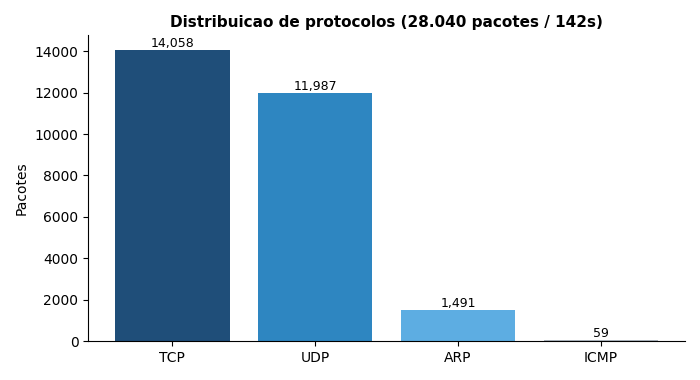
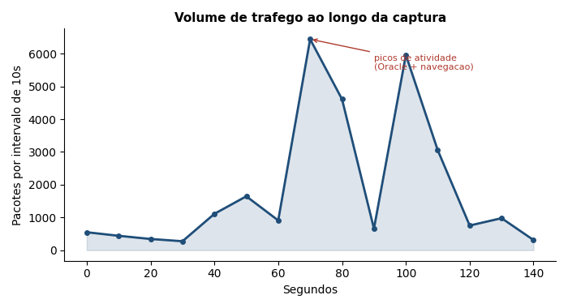
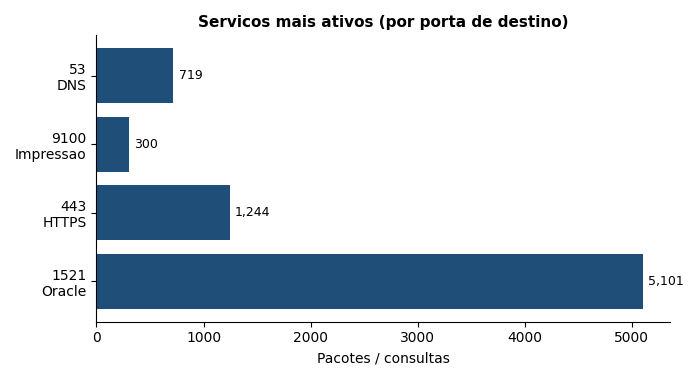

# Lab 01 — Anatomia de uma captura de rede real

Neste lab eu peguei uma captura de tráfego de uma rede corporativa real e tentei responder a uma pergunta simples: **se eu fosse o analista responsável por monitorar essa rede, o que eu conseguiria entender só olhando os pacotes?**

Não é um lab de laboratório limpo com dois hosts trocando ping. São 28.040 pacotes de uma rede de verdade, com impressoras, banco de dados, gente navegando na internet e todo o ruído que existe num ambiente de produção. O desafio real de um SOC não é entender um pacote isolado — é achar sinal no meio do barulho. Foi isso que pratiquei aqui.

**Ferramenta:** Wireshark 4.x
**Amostra:** 28.040 pacotes · 142 segundos de captura
**Tipo de rede:** corporativa, faixa interna `10.40.x.x`

> Nota: IPs internos e nomes de máquina foram mantidos genéricos onde poderiam identificar pessoas ou ativos específicos.

---

## Primeira impressão: quem está falando e quanta coisa

A primeira coisa que fiz foi olhar o volume. 28 mil pacotes em pouco mais de dois minutos é bastante — dá uma média de ~197 pacotes por segundo. Antes de filtrar qualquer coisa, quis entender a proporção entre os protocolos de transporte.



TCP e UDP dividem quase igualmente o tráfego. Isso já me disse algo: metade do que roda nessa rede é UDP, e UDP em rede corporativa quase sempre significa **descoberta de serviços e DNS**. Confirmei isso depois — grande parte é mDNS (`.local`), aquele tráfego que impressoras e computadores usam para se anunciar na rede.

Os 1.491 pacotes ARP também fazem sentido: ARP é o "quem tem esse IP?" da rede local, e numa rede com muitos dispositivos ele aparece o tempo todo. Nada disso é anomalia — é o barulho de fundo normal. Mas eu precisava saber que é normal para, um dia, reconhecer quando **não** for.

---

## O tráfego não é constante — ele tem picos

Olhei então como o volume se distribui no tempo, em janelas de 10 segundos:



Isso me chamou atenção. Os primeiros 40 segundos são calmos (~300-500 pacotes por janela). Depois, por volta dos 70s e dos 100s, o tráfego explode para mais de 6.000 pacotes em 10 segundos.

Fui atrás do que causou esses picos e a resposta foi o banco de dados. Os momentos de maior volume coincidem com rajadas de tráfego Oracle. Para um SOC, essa noção de **baseline temporal** importa: se eu soubesse que essa rede tem picos normais de banco às 14h, um pico idêntico às 3h da manhã seria exatamente o tipo de coisa que eu iria querer investigar.

---

## Os serviços: onde o tráfego realmente vai

Filtrei por porta de destino para ver quais serviços dominam:



A porta **1521 (Oracle Database)** é a estrela, com mais de 5.000 pacotes. E aqui veio a parte mais interessante da análise: filtrei `tcp.port == 1521` e olhei **quem** estava falando com o banco.

Praticamente todo esse tráfego vinha de **um único host** (`10.40.255.180`). Isso é coerente — provavelmente uma aplicação ou um servidor que consulta o banco intensamente. Mas foi aqui que a mentalidade de SOC clicou pra mim: se amanhã um segundo host, que nunca conversou com o Oracle antes, de repente começasse a mandar milhares de pacotes pra porta 1521, isso seria um alerta. Poderia ser uma aplicação nova legítima — ou poderia ser alguém tentando acessar dados que não deveria. A única forma de saber a diferença é **conhecer o baseline**.

| Porta | Serviço | Volume | O que significa |
|---|---|---|---|
| 1521 | Oracle DB | ~5.100 | Um host consultando o banco intensamente |
| 443 | HTTPS/TLS | ~1.244 | Navegação e serviços cifrados (28 destinos distintos) |
| 53 | DNS | 719 consultas | Resolução de nomes |
| 9100 | Impressão | — | Comunicação com impressoras de rede |

---

## O handshake TCP na prática

Quis ver um handshake completo com dados reais, não o diagrama de livro. Filtrei `tcp.flags.syn == 1` e peguei uma conexão de um PC com uma impressora:

```
[SYN]      10.40.255.180:60275  ->  10.40.1.84:9100     "quero conectar"
[SYN, ACK] 10.40.1.84:9100      ->  10.40.255.180:60275 "ok, pode vir"
[ACK]      10.40.255.180:60275  ->  10.40.1.84:9100     "fechado, conexao ativa"
```

Contei na captura inteira: **90 SYN** e **60 SYN-ACK**. Essa diferença me fez pensar. Nem toda tentativa de conexão vira conexão — host desligado, porta fechada, timeout. 30 SYNs sem resposta, numa rede desse tamanho e nesse tempo, é normal.

Mas essa métrica é justamente uma das que um SOC observa. Um **port scan** aparece como um monte de SYN saindo de um host para muitas portas diferentes, quase nenhum recebendo SYN-ACK de volta. Um **SYN flood** (ataque de negação de serviço) é uma enxurrada de SYN sem nunca completar o terceiro passo. A relação entre SYN e SYN-ACK conta uma história — aqui a história é "rede normal", mas agora eu sei que forma tem o normal.

---

## DNS: o mapa de para onde todo mundo quer ir

Das 719 consultas DNS, separei o tráfego interno (`.local`, descoberta de dispositivos) das resoluções de domínios externos.

No lado interno, apareceram nomes de dispositivos da própria rede — estações de trabalho, impressoras de setores. É o mDNS fazendo o inventário natural da rede.

No lado externo, alguns dos domínios consultados:

```
download.windowsupdate.com     -> Windows se atualizando (esperado)
ctldl.windowsupdate.com        -> verificacao de certificados
[servidor de e-mail interno]   -> cliente de e-mail conectando
web.whatsapp.com               -> WhatsApp Web
chat.deepseek.com              -> servico de IA
api.msn.com                    -> servicos Microsoft
```

Tudo aqui é legítimo. Mas o DNS é, na minha opinião, a fonte mais subestimada de detecção. Todo malware precisa "ligar pra casa" — chamar o servidor de comando e controle. E quase sempre faz isso resolvendo um domínio primeiro. Se eu estivesse monitorando essa rede, meus alertas de DNS seriam para: domínios registrados há poucos dias, nomes que parecem gerados por máquina (`kq3f9x2plm.com`), ou resoluções para domínios em listas de ameaças. Nenhum desses apareceu aqui — mas a prática de olhar cada domínio com esse olhar foi o exercício.

---

## O que trafega em texto claro

Apesar de quase tudo estar em HTTPS, filtrei `http` e achei duas requisições em texto claro:

```
GET /msdownload/.../pinrulesstl.cab   ->  ctldl.windowsupdate.com
GET /                                  ->  yr.i.lencr.org (Let's Encrypt / OCSP)
```

As duas são inofensivas — verificação de certificado e revogação. Mas o ponto vale: nessas requisições eu consigo ler o caminho completo, o host, os cabeçalhos, tudo. Se fosse um formulário de login em HTTP, eu leria o usuário e a senha ali, em texto puro. É a razão de HTTPS existir. E é por isso que, num SOC, tráfego HTTP inesperado saindo de um servidor que deveria só falar HTTPS é um sinal para investigar.

---

## O que eu tiro disso

Se eu resumir o que esse lab me ensinou na prática:

1. **Ruído é o normal.** Metade UDP, ARP constante, mDNS por todo lado — uma rede real é barulhenta. O trabalho não é eliminar o ruído, é conhecê-lo bem o suficiente pra enxergar o que destoa.

2. **Baseline é tudo.** Um host fala com o Oracle. Os picos acontecem em certos momentos. As conexões têm uma proporção SYN/SYN-ACK. Nada disso é interessante sozinho — mas é o retrato do "normal" contra o qual todo alerta futuro vai ser comparado.

3. **Cada camada conta uma parte.** ARP diz quem está na rede local. DNS diz para onde querem ir. TCP diz se conseguiram chegar. HTTP/TLS diz o que trocaram. Investigar é juntar essas partes.

4. **Filtrar é a habilidade central.** 28 mil pacotes são intratáveis a olho nu. Com o filtro certo, viram uma resposta específica. Metade do trabalho de análise é saber qual pergunta fazer ao Wireshark.

---

## Próximos labs

- [ ] Lab 02 — Focar em DNS: como identificaria um domínio de C2 no meio do tráfego legítimo
- [ ] Lab 03 — Simular um port scan e ver como ele aparece na relação SYN/SYN-ACK
- [ ] Lab 04 — Abrir um handshake TLS completo e entender o que dá pra ver (e o que não dá) em tráfego cifrado
